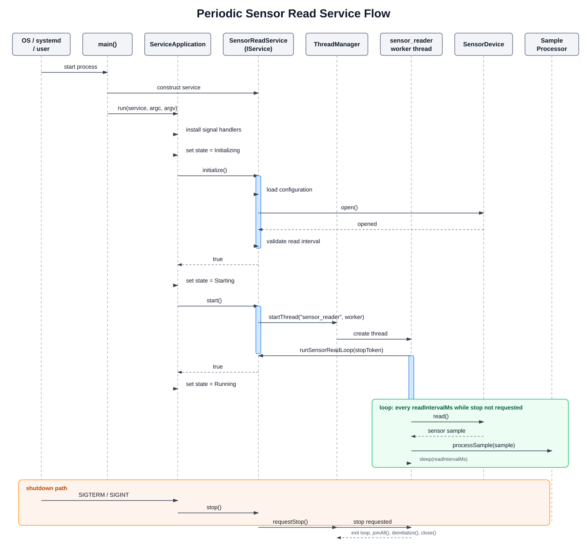

# Periodic Sensor Read Flow

This diagram shows how a periodic sensor read service runs on top of the
Phase 1 ELAP service framework.

PlantUML source:

- [periodic_sensor_read_sequence.puml](periodic_sensor_read_sequence.puml)

Key flow:

1. `main()` creates the concrete `SensorReadService`.
2. `ServiceApplication::run()` owns the common lifecycle.
3. `initialize()` loads configuration and opens the sensor device.
4. `start()` asks `ThreadManager` to create the periodic worker thread.
5. The worker thread calls `runSensorReadLoop(stopToken)`.
6. The loop reads the sensor periodically and processes samples.
7. On `SIGTERM` or `SIGINT`, `stop()` requests worker shutdown and joins the thread.
8. `deinitialize()` closes the sensor device and releases resources.
